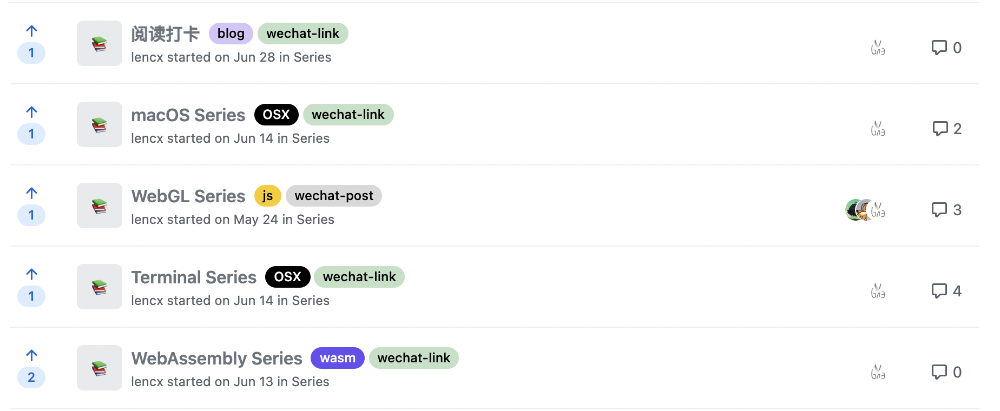

# woap

> woap - WeChat Official Accounts Platform

通过给 GitHub Discussions 打标签生成微信文章（支持二维码及脚注形式）

## 背景

如果要把 GitHub Discussions 上的话题同步到微信公众号，链接是无法直接在微信内打开的。为了增加用户体验，所以将链接转为二维码或脚注形式。

## 安装

```bash
# 全局安装
npm i -g woap
```

## 用法

```bash
# 查看帮助
woap -h

# 例如
woap --owner=lencx --repo=z --token=your_github_token --root=docs --qrcode-tip=识别二维码
```

### 参数

```bash
usage: woap

options:
  --owner:     GitHub 用户名（username）

  --repo:      需要生成微信文章的 GitHub 仓库名（请确保已经开启 Discussions）
               `Repository -> Settings -> Options -> Features -> Discussions`

  --token:     GitHub API 请求需要用到，获取 GitHub Token -> `https://github.com/settings/tokens/new`

  --root:      生成文章的根目录, 默认值为 `posts`

  --ext:       生成文件的扩展名, 默认值为 `html`，可选值 `md` 或 `html`

  --tip:       二维码提示文案，默认值为 `长按识别二维码查看原文`

  --title:     文章的脚注标题，默认值为 `参考资料`

  --labels:    需要生成微信文章的 labels，多个 labels 使用英文逗号 `,` 分割，内置 `wechat-link,wechat-post`
               新增的 labels 只能生成微信脚注类的文章
               - wechat-link: 生成微信二维码文章（将链接转为二维码）
               - wechat-post: 生成微信脚注文章（将链接转为脚注）
```

## Discussions 如何打标签



[项目示例](https://github.com/lencx/z/discussions)

- 如果属于资源聚合类（链接列表），推荐使用 `wechat-link` 标签，生成二维码形式
- 如果属于博客文章类，推荐使用 `wechat-post` 标签，生成脚注形式

### GitHub Actions

> 配合 GitHub Actions 使用，每天定时生成

- [.github/workflows/deploy.yml](https://github.com/lencx/z/blob/main/.github/workflows/deploy.yml#L22)
- [package.json](https://github.com/lencx/z/blob/main/package.json#L14)

## 截图预览

点击页面右上角的公众号按钮，则复制文章到剪贴板，前往公众号粘贴即可（如果二维码过多，复制到公众号，可能会有上传失败的几率，建议把失败的二维码手动做替换，暂时无法确定图片上传失败原因）。

- 二维码形式

  

- 脚注形式

  

---

## 视频演示

- [woap - GitHub Discussions 一键脚本自动生成微信文章](https://www.bilibili.com/video/BV1Ab4y1r7uE?share_source=copy_web)

## 微信群

> 欢迎进群交流相关问题及更多 GitHub 使用小技巧，如果二维码过期，可以关注公众号《浮之静》，发送“进群”，我将拉你进群一起学习。

 

### License

MIT License © 2021 [lencx](https://github.com/lencx)