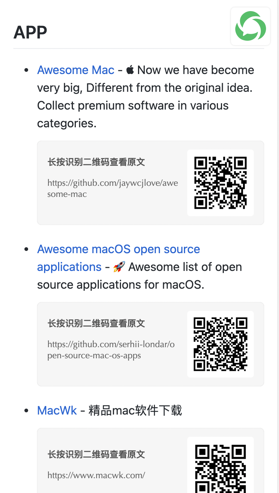
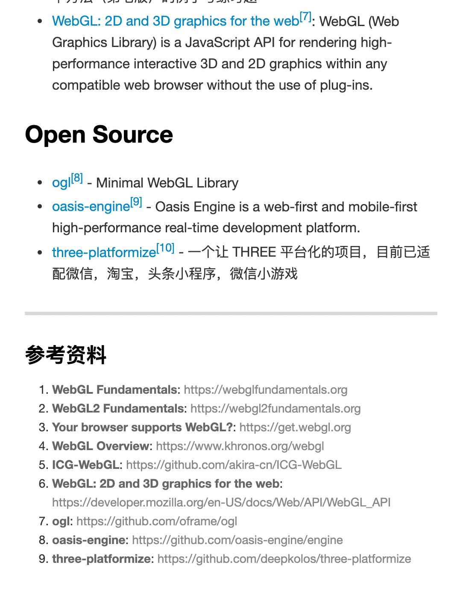

# woap

> 通过给 GitHub Discussions 打标签生成微信文章（支持二维码及脚注形式）

## 安装

```bash
# 全局安装
npm i -g woap
```

## 用法

```bash
# 查看帮助
woap -h

# 例如
woap --owner=lencx --repo=z --token=your_github_token --root=docs --qrcode-tip=识别二维码
```

### 参数

```bash
usage: woap

options:
  --owner:          GitHub 用户名（username）

  --repo:           需要生成微信文章的 GitHub 仓库名（请确保已经开启 Discussions）
                    `Repository -> Settings -> Options -> Features -> Discussions`

  --root:           生成文章的根目录, 默认值为 `posts`

  --qrcode-tip:     二维码提示文案，默认值为 `长按识别二维码查看原文`

  --footnote-title: 微信链接脚注标题，默认值为 `参考资料`

  --token:          GitHub API 请求需要用到，获取 GitHub Token -> `https://github.com/settings/tokens/new`

  --labels:         需要生成微信文章的 labels，只能生成带微信脚注的文章
                    多个 labels 使用英文逗号 `,` 分割，内置 `wechat-link,wechat-post`
                    - wechat-link: 生成微信二维码文章（将链接转为二维码）
                    - wechat-post: 生成微信脚注文章（将链接转为脚注）
```

## 截图预览

- 脚注形式
  

- 二维码形式
  

---

### License

MIT License © 2021 [lencx](https://github.com/lencx)